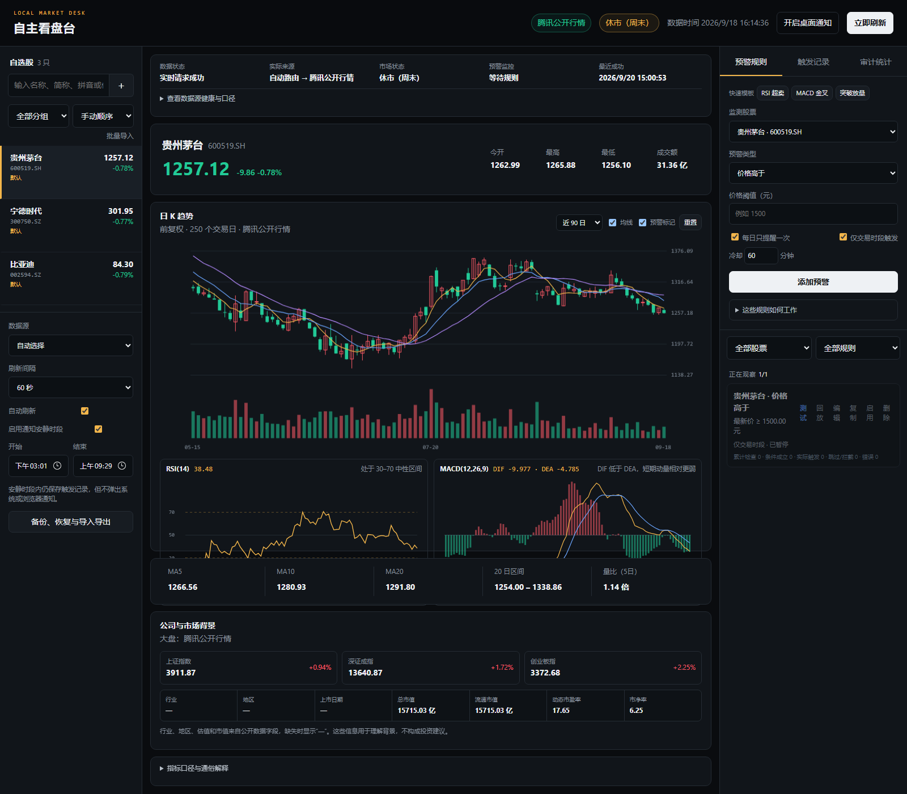
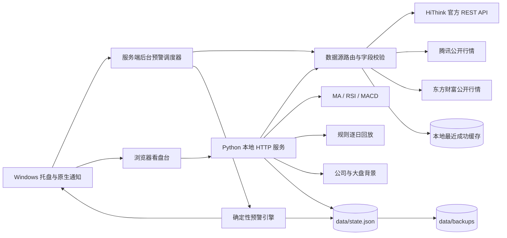

# 自主看盘台 V2

一个在 Windows 本机运行的 A 股行情观察、技术指标学习和确定性条件预警工具。项目只使用 Python 标准库和浏览器原生能力，默认无需付费订阅，也不调用大模型。



## 项目边界

- 本机运行，数据、自选股和规则保存在本地。
- HiThink Financial API 是可选官方来源，公开行情仍可独立运行。
- 只做行情观察、指标计算和条件提醒。
- 不连接券商，不自动交易，不预测收益，不输出买卖建议。

## V2 能力

- 自选股支持名称片段、拼音简称和股票代码模糊搜索，点击候选即可添加并本地持久化。
- 自选股支持分组、备注、涨跌幅/名称排序和一次导入最多 50 个代码。
- 行情快照：最新价、涨跌幅、开高低、成交量和成交额。
- 前复权日 K、成交量、MA5/10/20/60、RSI(14)、MACD(12,26,9)。
- 价格阈值、均线穿越、区间突破、成交量放大、RSI 区域、MACD 金叉/死叉、突破并放量七类规则。
- 规则启停、冷却时间、每日一次、仅交易时段触发和不落记录的即时试算。
- 规则支持编辑、复制、按股票/类型筛选，并提供 RSI 超卖、MACD 金叉和突破放量快速模板。
- 可配置跨午夜安静时段；命中仍保存记录，但不发送 Windows 或浏览器通知。
- 触发记录支持按股票、规则、日期筛选，并导出当前筛选结果为 UTF-8 CSV。
- 每条规则可用最多 750 根已完成日 K 做逐日历史回放，汇总触发次数及 1/5/20 个交易日后的样本分布；回放只验证规则行为，不预测未来。
- 预警审计区记录未命中、持续成立、时段跳过、每日/冷却拦截、数据源失败、正常触发和静默触发，并按规则累计检查、成立、触发、跳过、拦截和错误次数。
- 公司与市场背景区展示上证、深证、创业板指数，以及所选股票的公开市值和估值字段；东方财富公司概况失败时降级到腾讯的部分字段。
- 服务端后台预警循环；浏览器关闭后仍检查并保存触发记录。
- Windows 原生托盘与通知；可打开页面、暂停/恢复预警、查看日志和安全退出。
- 无控制台便携 EXE、同端口单实例保护、8765–8775 自动端口回退和本地轮转日志。
- 数据源自动降级、字段校验、最近成功/错误/耗时和实际来源展示。
- 失败来源短时熔断，冷却期间直接尝试备用源，避免刷新反复卡住。
- 开盘可选 10 秒行情轮询；日 K 与指标最多每 60 秒更新一次，减少公共接口压力。
- 实时、缓存、暂时失败、源时间缺失四种状态明确区分。
- 交易时段发现行情时间落后超过 3 分钟时给出可见提示，并可一键测试当前报价与历史 K 线路由。
- K 线支持 60/90/120/250 日范围、滚轮缩放、拖动查看历史、均线开关和触发记录标记。
- 状态文件带版本号；修改前自动轮换备份（最多 20 份），并支持手动备份、恢复及 JSON 导入导出。
- 2026 年交易状态使用上交所官方休市安排；未覆盖年份明确标为估算。
- 窄窗口响应式布局，390px 宽度下无横向溢出。

## 架构与数据流



浏览器负责展示和操作，服务端后台调度器负责按交易时段与用户间隔检查规则。行情请求成功后写入 `data/cache/`。本轮所有外部来源都失败时，页面可以展示最近成功缓存，但会标为“缓存数据”；预警引擎不会用缓存触发新提醒。用户修改设置、自选股或规则前会先把旧状态写入 `data/backups/`。状态、备份、日志与缓存目录均被 Git 忽略。

## 启动

要求：Windows 10/11、Python 3.10 或更高版本。项目没有第三方 Python 依赖。

在项目根目录打开 PowerShell：

```powershell
.\start.ps1
```

浏览器会打开 `http://127.0.0.1:8765`。在 PowerShell 中按 `Ctrl+C` 停止。

### Windows 便携版

运行 `build-windows.ps1` 会在 `release\自主看盘台` 生成完整便携文件夹。双击其中的 `自主看盘台.exe` 即可启动，目标电脑无需另装 Python。程序不显示黑色控制台，运行期间驻留在 Windows 通知区域；双击托盘图标可打开页面，右键可暂停/恢复预警、打开日志目录或退出。自选股、预警规则和记录保存在便携文件夹的 `data\state.json`，迁移时复制整个文件夹即可。

`portable.mode` 标记会启用严格便携模式：程序不写注册表开机启动项，不依赖固定盘符、用户名或安装目录，所有应用数据都留在当前文件夹的 `data\` 下。默认端口 8765 被其他程序占用时，会依次尝试 8766–8775。Edge 或 Chrome 可用时，页面会优先在 InPrivate/无痕窗口打开，减少浏览器历史记录。关闭浏览器不会停止程序；需要完全停止时使用托盘菜单的“退出”。日志保存在 `data\logs\app.log`，单个文件达到约 1 MB 后自动轮转，最多保留当前文件和 3 个备份。

需要发给其他人时，再运行 `package-shareable.ps1`。它会生成 `release\自主看盘台-分享版-Windows-x64.zip`，排除当前用户的 `state.json`、缓存、日志和备份；接收者完整解压到有写权限的位置后双击 EXE 即可。该构建面向 Windows 10/11 64 位 Intel/AMD 电脑，不保证 Windows 7/8、ARM64、32 位 Windows 或被单位安全策略限制的电脑可运行。`_internal` 是运行时的一部分，不能只复制 EXE。

便携模式消除了程序自身的机器绑定和跨电脑迁移障碍，但无法保证操作系统完全不留痕。Windows Defender/SmartScreen、DNS、代理、防火墙、路由器和浏览器仍可能按各自策略保存记录；未签名 EXE 在新电脑上也可能显示“未知发布者”。公开行情源还可能被某些网络拦截、限流或临时不可用，程序会自动换源并明确显示失败，但无法在所有网络下保证实时数据。完整边界见 [`outputs/便携性说明.md`](outputs/便携性说明.md)。

也可以只启动服务：

```powershell
python src\server.py
```

便携入口位于 `outputs\启动自主看盘台.ps1`，可从 `outputs` 目录直接运行。

## 数据源与降级顺序

| 界面选择 | 行情快照 | 历史日 K |
|---|---|---|
| 自动选择，无 Key | 腾讯 → 东方财富 | 东方财富 → 腾讯 |
| 自动选择，有 Key | HiThink → 腾讯 → 东方财富 | HiThink → 东方财富 → 腾讯 |
| 公开行情 | 腾讯 → 东方财富 | 东方财富 → 腾讯 |
| 同花顺官方 | HiThink 先行，失败后公开源降级 | HiThink 先行，失败后公开源降级 |

公开接口不是正式稳定契约，可能限流、关闭连接或改变字段。本项目会显示实际成功来源，而不是只显示用户选择的路由。来源失败后会进入 30 秒起、最长 15 分钟的短时冷却；请求会继续尝试备用源。公开来源报告的成交量按“手”接收并换算为“股”；跨来源比较前仍应核对口径。

HiThink 当前官方文档规定：请求使用 `X-api-key`，成功条件是响应 `code == 0`，快照和历史记录位于 `data.item`。Key 只从 `HITHINK_FINANCE_API_KEY` 环境变量读取，不进入代码、前端、日志、测试样本或 Git。

当前 PowerShell 会话临时配置示例：

```powershell
$env:HITHINK_FINANCE_API_KEY = "你的 Key"
.\start.ps1
```

本项目不承诺 HiThink 免费、固定价格或固定账户权限；正式使用前应重新查看[官方仓库](https://github.com/HiThink-Tech/Financial-API)、[REST API 通用约定](https://github.com/HiThink-Tech/Financial-API/blob/main/docs/api/README.md)、[行情快照契约](https://github.com/HiThink-Tech/Financial-API/blob/main/docs/api/a-share/prices-snapshot.md)和[历史 K 线契约](https://github.com/HiThink-Tech/Financial-API/blob/main/docs/api/a-share/prices-historical.md)。

## 状态含义

| 状态 | 含义 | 预警行为 |
|---|---|---|
| 实时请求成功 | 本轮至少一个外部来源成功 | 使用本轮数据检查规则 |
| 缓存数据 | 本轮外部请求失败，展示最近成功缓存 | 跳过本轮预警 |
| 暂时失败 | 外部请求失败且没有可用缓存 | 保留旧页面，不生成行情 |
| 源时间缺失 | 来源未提供有效数据时间 | 显示刷新时间，不伪造数据时间 |

2026 年“交易时段”根据本地保存的上交所官方休市安排和北京时间判断，日历来源与覆盖状态会随健康接口返回。其他年份在尚未补入官方日历时按工作日和时钟估算，并在页面标明估算口径。

## 指标口径

- **MA(N)**：最近 N 个交易日收盘价的简单平均。
- **RSI(14)**：Wilder 平滑。第 15 根 K 线产生首个值；连续上涨为 100，连续下跌为 0，无涨跌为 50。30/70 只描述历史相对位置。
- **MACD(12,26,9)**：EMA 以第一根收盘价为初值；`DIF = EMA12 - EMA26`，`DEA = EMA9(DIF)`，`MACD柱 = 2 × (DIF - DEA)`。
- **量比（5日）**：最新一根 K 线成交量 ÷ 前 5 根 K 线平均成交量。

指标结果仅用于学习和观察，不构成投资建议。

## 预警口径

- 价格高于/低于：使用本轮行情快照，只在条件从不成立变为成立时触发。
- 均线穿越：使用已完成日 K，比较前一日和当前日的均线相对位置。
- 区间突破：当前已完成日 K 与此前 N 个交易日的高点/低点比较，不把当前 K 线放入阈值。
- 成交量放大：当前已完成日 K 与此前 N 日平均成交量比较。
- RSI 区域：使用 Wilder RSI，可配置周期、方向和阈值；只在条件从未成立变为成立时触发。70/30 是常用观察线，不代表买卖建议。
- MACD 金叉/死叉：使用已完成日 K；最近两根 K 线间 DIF 上穿 DEA 为金叉，下穿为死叉。
- 突破并放量：区间突破和成交量放大必须在同一根已完成日 K 上同时成立。

每日一次和冷却时间会进一步限制重复提醒。新建规则默认只在交易时段触发；非交易时段不会消耗条件状态，下一次开盘仍能识别首次进入。默认安静时段为 15:01–09:29，允许跨午夜配置；安静时段内允许执行的规则仍会保存记录，但不弹窗。“立即测试”使用当前真实快照和最新已完成日 K，只返回试算结果，不写触发记录、不发通知。只要本地服务或 EXE 仍在运行，浏览器关闭后后台仍会检查；电脑关机、休眠或程序退出时不会持续监测。

“回放”按日期顺序逐根加入已完成日 K，每个事件判定只使用当日及更早的数据，避免把未来数据用于触发判断。价格阈值在历史回放中使用日收盘价近似，因此无法还原盘中曾短暂越过阈值的情况。1/5/20 日后的涨跌统计只描述这些历史事件后的样本分布；样本少、市场环境变化、滑点和交易成本都会限制解释范围。

## 本地数据保护

- `data/state.json` 当前结构版本为 4；旧版本在读取时自动补齐分组、备注、规则累计统计和审计字段。
- 添加、编辑或删除自选股/规则以及修改设置之前，程序自动保存旧状态；只保留最近 20 份。
- 页面左侧“备份、恢复与导入导出”可立即备份、恢复旧版本、导出完整 JSON 或导入另一台电脑的数据。
- 导入与恢复前还会备份当时状态；非法股票代码、未来结构版本、错误字段类型和过大列表会被拒绝。
- API Key 不在状态文件、导出文件或备份中。

## 本地 API

- `GET /api/health`：服务时间、交易时段口径、后台监控状态、各来源健康/冷却状态和能力说明。
- `GET /api/state`：自选股、设置、规则和触发记录。
- `GET /api/search?q=茅台`：搜索沪深北 A 股名称、拼音简称或代码，最多返回 10 个候选。
- `GET /api/quotes`：行情快照、实际来源、实时/缓存状态。
- `GET /api/history?symbol=600519.SH&limit=250`：日 K 和全部指标。
- `GET /api/company?symbol=600519.SH`、`GET /api/market-overview`：公开公司背景和三大指数摘要，支持显式缓存状态。
- `GET /api/alerts`：规则与触发记录。
- `GET /api/audit?symbol=&status=&limit=`：规则累计统计和最近审计明细。
- `GET /api/export`、`GET /api/backups`：导出状态和查看本地备份。
- `GET /api/records.csv?symbol=&type=&date=`：导出筛选后的触发记录。
- `POST /api/backups`、`POST /api/backups/{name}/restore`、`POST /api/import`：备份、恢复和导入。
- `POST /api/source-test`：实际请求一只股票的报价与 10 根日 K，返回来源和耗时。
- `POST /api/watchlist/bulk`：一次导入 1–50 个股票代码。
- `POST /api/alerts/{id}/clone`、`PATCH /api/alerts/{id}`：复制和完整编辑规则。
- `POST /api/alerts/{id}/test`：使用当前真实数据试算单条规则，不写记录、不通知。
- `POST /api/alerts/{id}/backtest`：用已完成日 K 逐日回放规则，并返回历史事件和 1/5/20 日样本统计。
- `POST /api/evaluate`：用本轮实时数据检查启用规则。
- `POST/PATCH/DELETE /api/watchlist|alerts|records|settings`：本地状态管理。

历史接口在服务端把 `limit` 限制为 1–1000，并在返回前截断。

## 测试与验证

```powershell
python -m unittest discover -s tests -v
python -m py_compile src\server.py src\providers.py src\indicators.py src\windows_desktop.py
```

截至 2026-09-20，本地自动化测试为 58 项，覆盖后台监控、原生通知、托盘命令、便携模式注册表保护、Windows 独占端口与自动回退、绝对路径防泄漏、并发状态保护、状态迁移与备份轮换、导入校验、MA/RSI/MACD 与七类规则、无未来数据回放、前瞻收益样本计算、交易时段跳过、预警审计、跨午夜安静时段、记录筛选/CSV、防公式注入、字段异常、公司信息降级、来源回退、缓存和官方休市日历。

## 目录

```text
src/                 Python 服务、数据源、指标与规则
web/                 无构建步骤的 HTML/CSS/JavaScript 页面
tests/               unittest 测试
data/trading_calendar.json  已核验的本地交易所休市日历
data/state.json      本地用户状态（Git 忽略）
data/backups/        修改前的状态备份，最多 20 份（Git 忽略）
data/cache/          最近成功行情缓存（Git 忽略）
data/logs/           本地轮转运行日志（Git 忽略）
outputs/             使用说明、通用截图和便携启动脚本
```
